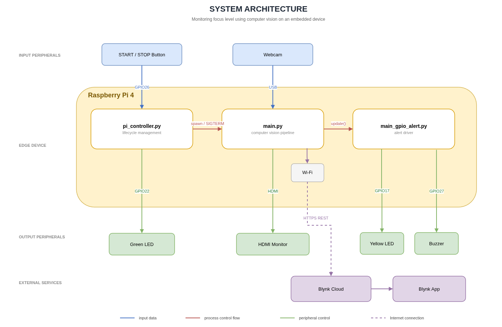
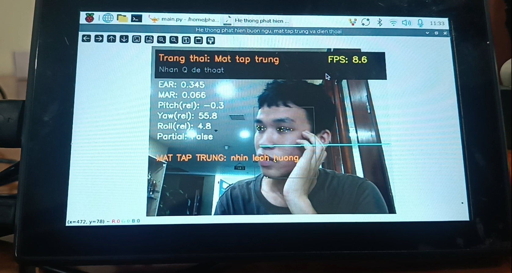

<div align="center">

# Distraction Detection System

**On-device attention and drowsiness monitoring for one person at a desk — MediaPipe Face Mesh and YOLO11n run entirely on a Raspberry Pi 4, and no video frame leaves the board.**


-A81D33)


</div>

---

## Overview

Sustained attention during online study and remote work is hard to measure: self-report is
unreliable, and camera-based services push a live video stream to a vendor's cloud. This
project keeps the whole vision pipeline on the edge device. A USB webcam feeds MediaPipe Face
Mesh and a YOLO11n phone detector on a Raspberry Pi 4; the board classifies the user as
focused, drowsy, distracted, using a phone, or away, drives an LED and buzzer over GPIO, and
pushes only the resulting state and counters to a Blynk dashboard. Across 88 functional test
cases the system passed 70 (80 %).

> [!NOTE]
> Scope is deliberately narrow: one person, seated indoors facing the device, under stable
> lighting. Multi-person frames are not supported — the pipeline tracks a single face and
> reports the first one it locks on to.

### DEMO

<p align="center">
  <a href="https://www.youtube.com/watch?v=52WKZ4SabQ0">
     
  </a>
  <br>
  <em>Click to watch the Demo video</em>
</p>

## Features

- **Drowsiness** — Eye Aspect Ratio over the six Face Mesh landmarks per eye, gated by a sustained-closure timer.
- **Yawning** — Mouth Aspect Ratio over inner and outer lip landmarks.
- **Gaze and posture** — head pose from six facial points, with a start-up calibration window and separate enter/exit angle thresholds to suppress flicker.
- **Phone usage** — YOLO11n exported to ONNX, run on ONNX Runtime CPU only, at a fixed frame stride and correlated against the face box.
- **Absence** — sustained loss of face detection, distinguished from a brief bend-down by a duration threshold.
- **Low-light guard** — frame brightness and noise statistics suspend monitoring rather than emitting false alerts.
- **Two-phase escalation** — yellow LED blinks alone for the first 2 s of an alert, then LED and buzzer pulse together.
- **Lifecycle control** — a green LED and a push button start and stop the vision process; a systemd user unit brings the controller up at login.

## Architecture



```text
USB webcam
   └─▶ main.py
         ├─▶ MediaPipe Face Mesh ─▶ EAR / MAR / head pose ─┐
         ├─▶ YOLO11n on ONNX Runtime ─▶ phone box ─────────┤
         │                                                 ▼
         │                                          state decision
         ├─▶ main_gpio_alert.update() ─▶ yellow LED + buzzer
         ├─▶ cv2.imshow() ─▶ HDMI overlay
         └─▶ Blynk HTTPS REST ─▶ dashboard
```

Three components run as two OS processes with disjoint GPIO ownership, so neither can claim a
pin the other holds:

| Component | Runtime | Owns | Role |
|---|---|---|---|
| `pi_controller.py` | System Python 3.13, apt `gpiozero` + `lgpio` | GPIO22 (green LED), GPIO26 (button) | Boot watchdog; spawns `main.py`, stops it with `SIGTERM`, returns to idle if it exits on its own |
| `main.py` | venv Python 3.11 | Camera, HDMI window, Blynk session | Vision pipeline and state decision |
| `main_gpio_alert.py` | Imported by `main.py` | GPIO17 (yellow LED), GPIO27 (buzzer) | Alert driver; `update()` is called once per frame, `cleanup()` on exit |

On stop, the controller waits up to 8 s for `main.py` to release GPIO17, GPIO27 and the camera
before escalating to `SIGKILL`. Blynk carries the current state on virtual pin V0 and five
cumulative event counters on V1–V5.

Detection thresholds, landmark index sets and timer windows all live in section 2 of
[`main.py`](main.py); they are not duplicated here.

## Results



88 functional test cases, executed manually on the assembled device, grouped by behaviour:

| Group | Function | Cases | Pass | Fail | Pass rate |
|---|---|---:|---:|---:|---:|
| A | Presence in frame | 18 | 13 | 5 | 72 % |
| B | Gaze direction and focus | 12 | 12 | 0 | 100 % |
| C | Phone usage detection | 20 | 17 | 3 | 85 % |
| D | Drowsiness and fatigue | 13 | 9 | 4 | 69 % |
| E | Abnormal behaviour | 15 | 9 | 6 | 60 % |
| F | Environment and system faults | 10 | 10 | 0 | 100 % |
| **Total** | | **88** | **70** | **18** | **80 %** |

> Functional pass/fail only. No latency, frame-rate or CPU-utilisation figures were recorded,
> so these numbers say nothing about runtime performance. Testing was done under the scope
> conditions above; the host and session count were not logged.

Failures concentrate on cases the single-face, threshold-based design cannot separate: natural
blinking versus drowsy closure (group D), and frames containing more than one person (group E).

## Requirements

| BCM | Header pin | Device | Direction |
|---:|---:|---|---|
| 17 | 11 | Yellow LED, 330 Ω series | out |
| 22 | 15 | Green LED, 330 Ω series | out |
| 26 | 37 | Push button to GND, internal pull-up, active LOW | in |
| 27 | 13 | Active buzzer, HIGH = sounding | out |

Also required: Raspberry Pi 4, USB webcam on index 0, HDMI display, Wi-Fi for the Blynk
dashboard (optional — the detection path does not need it).

| Software | Version | Source |
|---|---|---|
| Debian | 13 trixie, kernel 6.12, arm64 | Raspberry Pi OS |
| Python — controller | 3.13 (system) | apt `python3-gpiozero`, `python3-lgpio` |
| Python — vision | 3.11.9 | pyenv |
| opencv-python | 4.11.0.86 | pip |
| mediapipe | 0.10.18 | pip, nickoala aarch64 wheels |
| numpy | ≥ 1.26.4, < 2 | pip |
| onnxruntime | 1.26.0 | pip |

> [!WARNING]
> Three things block a clean clone-and-run. `main.py` currently carries a hardcoded
> `BLYNK_AUTH_TOKEN` — replace it with your own and read it from the environment before
> deploying. `pi_controller.py` sets `PROJECT_DIR` to an absolute path from the original
> machine, so edit it to match your checkout. And `yolo11n.onnx` must be exported on an x86
> host: PyTorch and ultralytics abort with `Illegal instruction` on the Pi 4's Cortex-A72.

## Quick start

Assumes Python 3.11.9 is already active via pyenv. Full setup, including the pyenv install and
the ONNX export, is in [`assets/INSTALL.md`](assets/INSTALL.md).

```bash
git clone https://github.com/xp1708/KHMTMT.git && cd KHMTMT
python3 -m venv venv --system-site-packages && source venv/bin/activate
pip install "numpy>=1.26.4,<2" "opencv-python==4.11.0.86" onnxruntime
pip install mediapipe --find-links https://github.com/nickoala/mediapipe-on-raspberry-pi/releases/
DISPLAY=:0 python3 main.py
```

<details>
<summary>Run through the button controller instead, with autostart at login</summary>

The controller runs on system Python, not the venv, and spawns `main.py` itself. Edit
`PROJECT_DIR` in `pi_controller.py` first.

```bash
sudo apt install python3-gpiozero python3-lgpio
/usr/bin/python3 pi_controller.py                  # manual test: green LED blinks at 1 Hz
mkdir -p ~/.config/systemd/user && cp pi-controller.service ~/.config/systemd/user/
systemctl --user daemon-reload && systemctl --user enable --now pi-controller
loginctl enable-linger "$USER"                     # survive logout
```

The unit uses `%h` rather than a hardcoded home directory. Deployment pitfalls, including why
this is a user service and not a system service, are in
[`README_DEPLOY.md`](README_DEPLOY.md).

</details>

## Repository layout

```text
├── main.py                       # Vision pipeline, state machine, Blynk client; thresholds in section 2
├── main_gpio_alert.py            # Yellow LED + buzzer driver, two-phase pattern
├── pi_controller.py              # Boot watchdog: green LED, button, spawn/stop main.py
├── pi-controller.service         # systemd user unit for the controller
├── assets/
    └── yolo11n.onnx                  # Phone detector, exported from yolo11n.pt at opset 12
├── assets/
│   ├── docs/             
│       ├── INSTALL.md                # Full install sequence and ONNX export     
│       ├── INSTALL_GUIDE_PITFALLS.md     # Catalogue of nine build failures on Pi 4 and their fixes
│       └── README_DEPLOY.md              # Hardware wiring, systemd registration, troubleshooting table
│   ├── results/
│   └── images/
│       └── system_architecture.png   # Diagram used above
```

## References

1. Student attentiveness analysis in virtual classroom using distraction, drowsiness and emotion detection — https://link.springer.com/article/10.1007/s44217-024-00117-7
2. Assessing student engagement from facial behavior in on-line learning — https://link.springer.com/article/10.1007/s11042-022-14048-8
3. A multimodal facial cues based engagement detection system in e-learning context using deep learning approach — https://link.springer.com/article/10.1007/s11042-023-14392-3
4. Real-Time Student Engagement Monitoring via Facial Landmark Analysis — https://www.mecs-press.org/ijmecs/ijmecs-v18-n1/v18n1-5.html
5. Optimizing student engagement detection using facial and behavioral features — https://link.springer.com/article/10.1007/s00521-025-11317-z
6. Student Engagement Detection Based on Head Pose Estimation and Facial Expressions Using Transfer Learning — https://link.springer.com/chapter/10.1007/978-3-031-88653-9_25
7. R. Khan and R. Debnath, "Human distraction detection from video stream using artificial emotional intelligence," *Int. J. Image Graphics Signal Proc.*, vol. 12, no. 2, pp. 19–29, 2020. Head pose estimation follows this method.

## Author

Team CE Comedians - Nguyễn Phạm Thiên Ân · Lâm Xuân Phước · Đàm Vĩnh Khang · Lê Khắc Duy · Trần Quốc Trinh · Huỳnh Phạm Nhật Tiến

Course project for CE410.Q21, Faculty of Computer Engineering, University of Information Technology, VNU-HCM.

### My contributions

| # | Task | Description |
|---|---|---|
| 1 | Algorithm research and detection criteria | Surveyed published literature on vision-based attention and drowsiness monitoring; selected EAR, MAR and head-pose estimation as the detection primitives and derived the threshold set and temporal windows used to classify user state. |
| 2 | Embedded deployment on Raspberry Pi 4 | Provisioned the runtime environment (pyenv Python 3.11.9, venv, MediaPipe aarch64 wheels, ONNX Runtime) and ported the vision pipeline to the board, resolving arm64 build and dependency constraints. |
| 3 | Hardware control and alert subsystem | Designed and implemented `main_gpio_alert.py` (two-phase LED/buzzer escalation), `pi_controller.py` (button-driven boot watchdog with process lifecycle management and graceful `SIGTERM` shutdown) and the `pi-controller.service` systemd user unit, then validated them on the assembled hardware. |

Released under the [MIT License](LICENSE).
