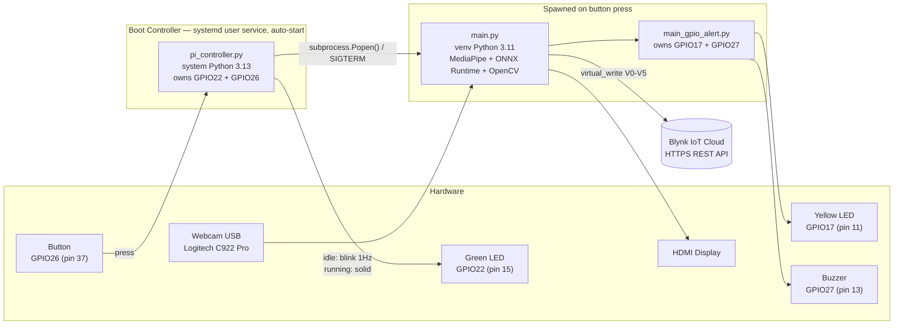
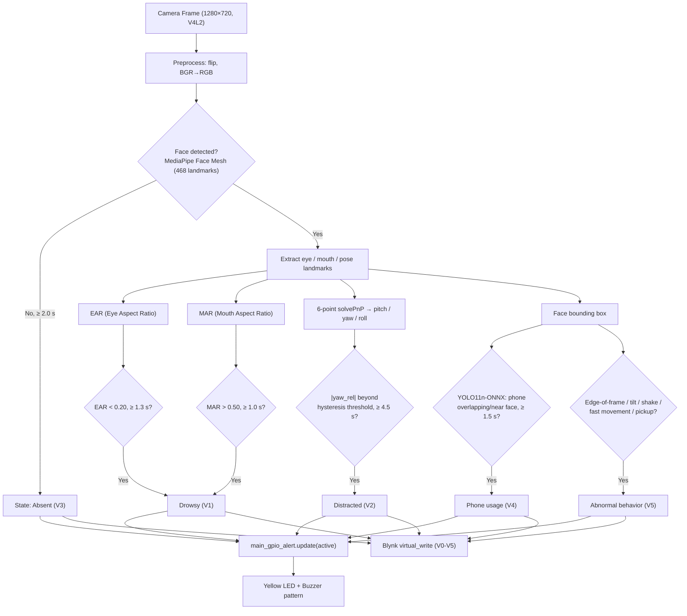

# Drowsiness & Distraction Detection System

Real-time, edge-AI system that monitors focus levels of students and remote workers — detecting **drowsiness, distraction, phone usage, and absence** — running entirely on a Raspberry Pi 4 with no video data ever leaving the device.

| | |
|---|---|
| **Team** | CE Comedians |
| **Course** | CE410.Q21 — Computer Systems Engineering Project |
| **Institution** | Faculty of Computer Engineering, University of Information Technology (UIT), Vietnam National University – Ho Chi Minh City |
| **Supervisor** | Dr. Nguyễn Minh Sơn |

📹 [Demo Video](https://drive.google.com/file/d/1hbr3oS7enMm2-M1b9AYo3p1FFQD-jJgH/view?usp=drive_link) &nbsp;·&nbsp; 💻 [Source Code](https://github.com/xp1708/KHMTMT)

---

## Table of Contents

1. [Overview](#overview)
2. [Key Features](#key-features)
3. [System Architecture](#system-architecture)
4. [Data Processing Pipeline](#data-processing-pipeline)
5. [Detection Logic & Thresholds](#detection-logic--thresholds)
6. [Hardware Setup](#hardware-setup)
7. [Tech Stack](#tech-stack)
8. [Project Structure](#project-structure)
9. [Installation Guide](#installation-guide)
10. [Boot Controller (Auto-Start via systemd)](#boot-controller-auto-start-via-systemd)
11. [Alert Behavior (LED & Buzzer Timing)](#alert-behavior-led--buzzer-timing)
12. [Troubleshooting / Known Issues](#troubleshooting--known-issues)
13. [Test Results](#test-results)
14. [Team & Supervisor](#team--supervisor)
15. [References](#references)

---

## Overview

In modern learning and work environments, sustaining focus is increasingly difficult due to distractions from personal devices. Existing solutions (mobile apps, wearables) lack objectivity and real-time responsiveness. This project builds a standalone device on **Raspberry Pi 4** that applies **Edge AI** to detect focus-relevant behaviors directly from a webcam feed, without uploading video to any server — preserving user privacy while providing instant audio/visual feedback and a real-time dashboard via **Blynk IoT**.

**Scope:** indoor, single-person setups (study desk / home office) under reasonably stable lighting. The system recognizes four core states — *focused, drowsy, using phone, away from seat* — plus five abnormal-behavior sub-cases (see [§5](#detection-logic--thresholds)).

## Key Features

- **Drowsiness detection** — Eye Aspect Ratio (EAR) for sustained eye closure, Mouth Aspect Ratio (MAR) for yawning, combined with head-drop detection.
- **Distraction / gaze detection** — 6-point head-pose estimation (pitch/yaw/roll via `solvePnP`) with per-user baseline calibration at startup.
- **Absence detection** — no face detected for a sustained period.
- **Phone-usage detection** — YOLO11n object detector (exported to ONNX) checked for spatial overlap with the detected face.
- **Abnormal-behavior detection** — partial face at frame edge, excessive head tilt/shake, rapid movement, bending down to pick up an object (distinguished from head-drop drowsiness).
- **Real-time hardware alert** — two-phase yellow LED + buzzer escalation pattern (see [§11](#alert-behavior-led--buzzer-timing)).
- **Physical boot controller** — green LED + push button to start/stop monitoring without a keyboard, auto-starting on power-up via `systemd`.
- **Cloud dashboard** — per-category event counters and live status pushed to a Blynk IoT app over HTTPS.
- **Environment robustness** — low-light detection, camera-disconnect auto-retry, hysteresis on all angle-based thresholds to avoid flicker.

## System Architecture

The system runs as **two independent OS processes** that never contend for the same GPIO pins:



- **`pi_controller.py`** — always running (via `systemd`), owns the green status LED and the start/stop button. On press, it spawns/terminates `main.py` as a subprocess (`SIGTERM` → 8 s grace period → `SIGKILL` if needed).
- **`main.py`** — the detection engine, spawned on demand. Owns the camera, the yellow alert LED, and the buzzer (through `main_gpio_alert.py`).
- **`main_gpio_alert.py`** — a small driver module imported by `main.py`; translates a boolean `alert_active` flag into the two-phase LED/buzzer pattern.

*Source: `pi_controller.py`, `main.py`, `main_gpio_alert.py`, `Sơ_đồ_hệ_thống.drawio.xml` (diagram "Operating principle").*

## Data Processing Pipeline



*Source: `main.py` main loop; `Sơ_đồ_hệ_thống.drawio.xml` (diagram "Data Flow").*

## Detection Logic & Thresholds

All constants below are read directly from `main.py`.

**Drowsiness (V1)**

| Constant | Value | Meaning |
|---|---|---|
| `EAR_THRESHOLD` | 0.20 | Eyes considered closed below this ratio |
| `EYE_CLOSED_SECONDS` | 1.3 s | Sustained closure required to trigger alert |
| `MAR_THRESHOLD` | 0.50 | Mouth considered open (yawn) above this ratio |
| `YAWN_SECONDS` | 1.0 s | Sustained yawn duration required |

A combined "head-drop + eyes closed" case is also treated as drowsiness.

**Distraction (V2)**

| Constant | Value | Meaning |
|---|---|---|
| `YAW_ENTER_THRESHOLD` / `YAW_EXIT_THRESHOLD` | 20.0° / 15.0° | Hysteresis band to avoid flicker at the boundary |
| `DISTRACT_SECONDS` | 4.5 s | Sustained off-angle duration required |

**Absence (V3)**

| Constant | Value | Meaning |
|---|---|---|
| `NO_FACE_SECONDS` | 2.0 s | No face detected for this long → absent |

**Phone usage (V4)**

| Constant | Value | Meaning |
|---|---|---|
| `PHONE_CONF_THRESHOLD` | 0.45 | Minimum YOLO confidence for a phone detection |
| `PHONE_USE_SECONDS` | 1.5 s | Sustained phone-near-face duration required |
| `PHONE_IOU_WITH_FACE_THRESHOLD` | 0.02 | Minimum box overlap with face to count as "in use" |
| `PHONE_DETECT_EVERY_N_FRAMES` | 4 | Inference runs every 4th frame (CPU budget) |

**Abnormal behavior (V5)**

| Constant | Value | Meaning |
|---|---|---|
| `PARTIAL_FACE_MARGIN_PX` / `PARTIAL_FACE_SECONDS` | 25 px / 1.0 s | Face touching frame edge |
| `TILT_THRESHOLD` | 25.0° (sustained > 1.5 s) | Excessive head roll |
| `SHAKE_THRESHOLD` / `SHAKE_COUNT_LIMIT` | 15.0° / 3 | Direction reversals within a 2 s window |
| `MOVE_SPEED_THRESHOLD` | 0.15 (norm. units/s, sustained > 2.0 s) | Rapid face-position movement |
| `PICK_HEAD_DROP_THRESHOLD` / `PICK_OBJECT_SECONDS` | 28.0° / 1.0 s | Bending down (excluded from drowsiness if eyes stay open) |

**Environment & system**

| Constant | Value | Meaning |
|---|---|---|
| `LOW_LIGHT_BRIGHTNESS_THRESHOLD` / `LOW_LIGHT_NOISE_THRESHOLD` | 60 / 15 | Mean brightness / noise std-dev triggering low-light mode |
| `LOW_LIGHT_SECONDS` | 1.5 s | Sustained low-light duration before suppressing other alerts |
| `CAMERA_RETRY_LIMIT` | 5 frames | Failed reads before attempting camera reconnect |
| `CALIBRATION_SECONDS` | 2.0 s (≥ 15 samples, median) | Baseline head-pose calibration at startup |
| `HEAD_POSE_ALPHA` / `MAX_ANGLE_JUMP` | 0.25 / 20.0° | EMA smoothing factor / per-frame angle clamp |
| `ALERT_COOLDOWN_SECONDS` | 2.0 s | Minimum interval between audible beeps |

## Hardware Setup

**Bill of materials:** Raspberry Pi 4 Model B · Logitech C922 Pro USB webcam · 2× LED (green, yellow) · 1× active buzzer (< 25 mA) · 1× push button · 2× 220–470 Ω resistor (330 Ω recommended) · breadboard & jumper wires · microSD card · HDMI display.

| Component | GPIO (BCM) | Physical pin | Function | Owner process |
|---|---|---|---|---|
| Green LED | GPIO22 | 15 | Boot status — idle: blink 1 Hz, running: solid | `pi_controller.py` |
| Button | GPIO26 | 37 | Start/stop `main.py` (internal pull-up, active-LOW, tie to GND) | `pi_controller.py` |
| Yellow LED | GPIO17 | 11 | Alert indicator | `main_gpio_alert.py` |
| Active buzzer | GPIO27 | 13 | Alert sound (HIGH = on) | `main_gpio_alert.py` |

Wire each LED anode through its resistor to the GPIO pin; cathode to a common GND. The buzzer's (+) goes to GPIO27, (−) to GND — if your buzzer module draws > 25 mA or needs 5 V, drive it through a transistor instead of connecting it directly.

*Source: `README_DEPLOY.md` §1, `pi_controller.py`, `main_gpio_alert.py`.*

## Tech Stack

| Layer | Technology | Version |
|---|---|---|
| OS | Debian GNU/Linux 13 "trixie", ARM64 (aarch64) | Kernel 6.12 |
| Boot controller runtime | System Python (apt `python3-gpiozero`, `python3-lgpio`) | 3.13 |
| Detection engine runtime | Python via `pyenv`, isolated venv | 3.11.9 |
| Computer vision | OpenCV (`opencv-python`) | 4.11.0.86 |
| Face landmarks | MediaPipe Face Mesh (community aarch64/cp311 wheel) | 0.10.18 |
| Object detection | YOLO11n, exported to ONNX, served via ONNX Runtime (CPU) | — |
| Numerical | NumPy (pinned) | ≥ 1.26.4, < 2 |
| GPIO | `gpiozero` + `lgpio` backend | — |
| Cloud dashboard | Blynk IoT 2.0, custom HTTPS REST adapter (`BlynkHTTP` class, no `blynklib`) | — |
| Process supervision | systemd (user service) | — |

> **Why ONNX Runtime instead of PyTorch/ultralytics?** `torch ≥ 2.x` (pulled in by `ultralytics`) is compiled with CPU instructions unsupported by the Pi 4's Cortex-A72 core, causing an `Illegal instruction` crash at `model.predict()`. PyTorch no longer ships official Raspberry Pi wheels for torch 2.x. The YOLO11n model is therefore exported to ONNX **once, on an x86 machine**, and inference on the Pi runs entirely through `onnxruntime`, which has native aarch64 support. *(Source: `INSTALL_GUIDE_PITFALLS.md`, Debug Session 2 / Lỗi 9.)*

## Project Structure

```
project/
├── main.py                  # Detection engine (venv Python 3.11): camera, MediaPipe, ONNX, Blynk, alert logic
├── main_gpio_alert.py       # Driver: yellow LED + buzzer (GPIO17/27)
├── pi_controller.py         # Boot controller: green LED + button (GPIO22/26), spawns/kills main.py
├── pi-controller.service    # systemd user unit for auto-start on boot
├── yolo11n.onnx             # Phone-detection model (exported on x86, copied to Pi)
└── venv/                    # Python 3.11 virtual environment (created during setup)
```

## Installation Guide

### Prerequisites

- Raspberry Pi 4, Debian 13 (trixie), ARM64, flashed and booted with desktop autologin.
- An x86 machine (Linux/Windows) with Python + `pip`, used **once** to export the YOLO model.
- Logitech C922 Pro (or any UVC-compliant USB webcam) connected to the Pi.

### Step 1 — Export the YOLO model to ONNX (on the x86 machine)

```bash
python3 -m venv /tmp/yolo_export_env
source /tmp/yolo_export_env/bin/activate
pip install ultralytics

python3 -c "
from ultralytics import YOLO
model = YOLO('yolo11n.pt')
model.export(format='onnx', imgsz=640, opset=12, simplify=True)
"
# → produces yolo11n.onnx (~10-11 MB)

scp yolo11n.onnx <user>@<PI_IP>:~/Documents/ce_comedians/project/
```

`opset=12` is the sweet spot for `onnxruntime` on aarch64; `simplify=True` reduces graph nodes for faster inference.

### Step 2 — Prepare Python 3.11 on the Pi (via `pyenv`)

Debian 13 defaults to Python 3.13, for which MediaPipe has **no** aarch64 wheel. Install 3.11.9 alongside it:

```bash
sudo apt update && sudo apt upgrade -y
sudo apt install -y make build-essential libssl-dev zlib1g-dev libbz2-dev \
    libreadline-dev libsqlite3-dev curl libncursesw5-dev xz-utils tk-dev \
    libxml2-dev libxmlsec1-dev libffi-dev liblzma-dev git pkg-config

curl https://pyenv.run | bash
echo 'export PYENV_ROOT="$HOME/.pyenv"' >> ~/.bashrc
echo 'export PATH="$PYENV_ROOT/bin:$PATH"' >> ~/.bashrc
echo 'eval "$(pyenv init - bash)"' >> ~/.bashrc
source ~/.bashrc

pyenv install 3.11.9        # 15-25 minutes
cd ~/Documents/ce_comedians/project
pyenv local 3.11.9
python3 --version            # must print: Python 3.11.9
```

### Step 3 — Create the venv and install dependencies (exact order matters)

```bash
python3 -m venv venv --system-site-packages
source venv/bin/activate
pip install --upgrade pip setuptools wheel

# 1) Pin NumPy first
pip install "numpy>=1.26.4,<2"

# 2) OpenCV — a pip build compatible with Cortex-A72 (NOT opencv-python-headless)
pip install "opencv-python==4.11.0.86"
DISPLAY=:0 python3 -c "
import cv2, numpy as np
img = np.zeros((300,400,3), dtype=np.uint8)
cv2.imshow('Test', img); cv2.waitKey(2000); cv2.destroyAllWindows()
print('imshow OK')
"   # stop here if this fails — everything else depends on it

# 3) Pillow — override the version pulled from apt
pip install Pillow --force-reinstall

# 4) MediaPipe — community aarch64/cp311 wheel (PyPI has none for this platform)
pip install mediapipe \
    --find-links https://github.com/nickoala/mediapipe-on-raspberry-pi/releases/
python3 -c "import mediapipe as mp; print(mp.__version__)"   # expect 0.10.18

# 5) ONNX Runtime for phone detection (CPU)
pip install onnxruntime
python3 -c "import onnxruntime as ort; print(ort.get_available_providers())"

# 6) Re-pin NumPy — some of the above can silently upgrade it
pip install "numpy>=1.26.4,<2" --force-reinstall

# 7) GPIO stack for main_gpio_alert.py (yellow LED + buzzer)
sudo apt install -y liblgpio-dev
pip install gpiozero lgpio
python3 -c "from gpiozero import LED, Buzzer; from gpiozero.pins.lgpio import LGPIOFactory; print('venv GPIO OK')"
```

### Step 4 — Configure Blynk (optional)

`main.py` reads a hardcoded `BLYNK_AUTH_TOKEN` constant.

> ⚠️ **Security note:** do not commit a real token to a public repository. Replace the constant with an environment variable before publishing, e.g.:
> ```python
> BLYNK_AUTH_TOKEN = os.environ.get("BLYNK_AUTH_TOKEN", "")
> ```
> and export it at runtime (`export BLYNK_AUTH_TOKEN=...`) or via a `.env` file excluded by `.gitignore`. If a token has ever been committed to version control, rotate it on the Blynk console.

### Step 5 — Verify and run

```bash
python3 -c "
import cv2, mediapipe as mp, numpy as np, onnxruntime as ort
assert tuple(int(x) for x in np.__version__.split('.')[:2]) < (2, 0)
print('cv2:', cv2.__version__, '| mediapipe:', mp.__version__,
      '| numpy:', np.__version__, '| onnxruntime:', ort.__version__)
"

export DISPLAY=:0
python3 main.py     # press 'q' in the video window to exit
```

For unattended, button-controlled operation, see the next section.

*Source: `README.md` (installation guide), `INSTALL_GUIDE_PITFALLS.md`.*

## Boot Controller (Auto-Start via systemd)

`pi_controller.py` runs the green LED + button state machine independently of the desktop session, as a **user** `systemd` service (not `system`), so it automatically inherits `DISPLAY` for the camera window spawned later.

```bash
# 1) Point PROJECT_DIR in pi_controller.py to your actual home directory
#    (edit the line: PROJECT_DIR = Path("/home/<user>/Documents/ce_comedians/project"))

# 2) Also install the GPIO stack for the system Python used by the controller
sudo apt install -y python3-gpiozero python3-lgpio

# 3) Install the unit
mkdir -p ~/.config/systemd/user
cp pi-controller.service ~/.config/systemd/user/
systemctl --user daemon-reload
systemctl --user enable --now pi-controller.service
systemctl --user status pi-controller.service   # must show "active (running)"

# 4) (Recommended) enable lingering so the user systemd instance
#    is resilient to autologin timing
sudo loginctl enable-linger $(whoami)
```

> **Important:** the unit uses `WantedBy=default.target`, **not** `graphical-session.target`. On Debian 13 Trixie with Wayfire/labwc, `graphical-session.target` is never activated by the desktop session manager, so a unit that depends on it will silently never start (no error, no log entries). `default.target` is always reached after user-systemd initialization and does not depend on the desktop environment. *(Source: `README_DEPLOY.md` §7.1, verified via `systemctl --user list-units --type=target --all`.)*

Once running: the green LED blinks at 1 Hz while idle; pressing the button spawns `main.py` (LED goes solid); pressing again sends `SIGTERM` (up to 8 s grace period for GPIO/camera cleanup, then `SIGKILL`) and returns to idle.

## Alert Behavior (LED & Buzzer Timing)

`main_gpio_alert.update(alert_active)` is called every frame and drives a two-phase escalation pattern:

| Time since alert start | Yellow LED | Buzzer |
|---|---|---|
| 0 – 2 s (Phase 1) | Blinks 0.25 s ON / 0.25 s OFF | Silent |
| > 2 s (Phase 2) | Blinks 0.5 s ON / 0.5 s OFF | Synchronized with LED |
| Alert clears | OFF immediately, timer resets to 0 | OFF immediately |

*Source: `main_gpio_alert.py` docstring and implementation.*

## Troubleshooting / Known Issues

Consolidated from the project's install/deploy debugging sessions.

**Software environment**

| # | Symptom | Root cause | Fix |
|---|---|---|---|
| 1 | `No matching distribution found for mediapipe` | Debian 13's default Python 3.13 has no MediaPipe wheel | Use Python 3.11.9 via `pyenv` |
| 2 | `ModuleNotFoundError: mediapipe.python._framework_bindings` | `mediapipe-rpi4` package is a 32-bit `cp37m-arm` binary | Use the community aarch64/cp311 wheel from `nickoala/mediapipe-on-raspberry-pi` |
| 3 | `Illegal instruction` on any `cv2` call | PyPI `opencv-python` (recent builds) uses AVX/SSE instructions absent on Cortex-A72 | Pin `opencv-python==4.11.0.86` |
| 4 | `cv2.error: function not implemented` on `imshow()` | `opencv-python-headless` has no GUI backend | Use the non-headless build above |
| 5 | `numpy<2` / `numpy>=2` conflicting requirements | OpenCV(≥2) vs MediaPipe(<2) vs any torch-based package | Pin `numpy>=1.26.4,<2`; re-pin after installing any new package |
| 6 | `ImportError: cannot import name '_imaging' from 'PIL'` | apt-installed Pillow shadowing the venv's copy | `pip install Pillow --force-reinstall` |
| 7 | `OSError: [Errno 28] No space left on device` during install | `/tmp` is a ~1.9 GB tmpfs; large packages overflow it | `TMPDIR=~/pip_tmp pip install <package>` |
| 8 | `Illegal instruction` at `model.predict()` | `torch ≥ 2.x` (via `ultralytics`) has no official Pi 4 (Cortex-A72) build | Export YOLO to ONNX on x86; run inference via `onnxruntime` on the Pi |

**Deployment / systemd**

| # | Symptom | Root cause | Fix |
|---|---|---|---|
| 9 | Service `active (running)` reported, but green LED never blinks after reboot; journal is empty | Unit depends on `graphical-session.target`, which never activates under Wayfire/labwc on Trixie | Use `WantedBy=default.target` + soft `Wants=graphical-session.target` |
| 10 | Button press logs `LOI: khong tim thay venv Python`, `main.py` never spawns | `PROJECT_DIR` in `pi_controller.py` hardcodes a different username than `whoami` | Use `%h` specifier in the unit's `ExecStart`; manually match `PROJECT_DIR` to your actual home directory |

*Source: `INSTALL_GUIDE_PITFALLS.md`, `README_DEPLOY.md` §9.*

## Test Results

88 test cases across 6 functional groups (overall pass rate: **80 %**):

| Group | Function | Cases | Pass | Fail | Pass rate |
|---|---|---|---|---|---|
| A | Presence in frame | 18 | 13 | 5 | 72 % |
| B | Gaze direction & focus | 12 | 12 | 0 | 100 % |
| C | Phone usage detection | 20 | 17 | 3 | 85 % |
| D | Drowsiness & fatigue | 13 | 9 | 4 | 69 % |
| E | Abnormal behavior | 15 | 9 | 6 | 60 % |
| F | Environmental conditions & system errors | 10 | 10 | 0 | 100 % |
| **Total** | | **88** | **70** | **18** | **80 %** |

**Notable findings:**
- Groups B and F are fully reliable — head-pose gaze estimation and environmental-fault handling (low light, camera disconnect/lag, FPS drop) performed with a 100 % pass rate.
- Group A failures cluster around short-duration edge cases: the system doesn't yet clearly distinguish "brief absence" from "genuinely left the seat."
- Group C failures involve rapid glancing at a phone without a corresponding head-pose change — hard to distinguish from normal focus using the current feature set.
- Group D failures involve rapid blinking and "eyes open but not attentive" cases — the EAR threshold alone cannot capture reduced attentiveness when eyes remain open.
- Group E failures are concentrated on continuous head-shaking and multi-person scenes — the system is designed for single-person tracking only.

*Source: `Báo cáo cuối kì - CE Comedians.docx` §4.1–4.2, cross-verified against `BC_CuoiKy.pptx` Slide 20.*

## Team & Supervisor

| Member | Student ID | Role |
|---|---|---|
| Lâm Xuân Phước | 22521154 | Presenter |
| Đàm Vĩnh Khang | 22520606 | Member |
| Lê Khắc Duy | 22520317 | Member |
| Trần Quốc Trinh | 22521542 | Member |
| Huỳnh Phạm Nhật Tiến | 22521466 | Member |
| Nguyễn Phạm Thiên Ân | 22520015¹ | Member |

**Supervisor:** Dr. Nguyễn Minh Sơn

¹ *Source discrepancy: the official report (`.docx`) lists `22520015`; the slide deck (`.pptx`) lists `23520015`. The report value is used here — please confirm and correct if needed.*

## References

1. Kaewkaisorn et al., *Student attentiveness analysis in virtual classroom using distraction, drowsiness and emotion detection* — [Springer](https://link.springer.com/article/10.1007/s44217-024-00117-7)
2. Buono et al., *Assessing student engagement from facial behavior in on-line learning* — [Springer](https://link.springer.com/article/10.1007/s11042-022-14048-8)
3. *A multimodal facial cues based engagement detection system in e-learning context using deep learning approach* — [Springer](https://link.springer.com/article/10.1007/s11042-023-14392-3)
4. *Real-Time Student Engagement Monitoring via Facial Landmark Analysis* — [IJMECS](https://www.mecs-press.org/ijmecs/ijmecs-v18-n1/v18n1-5.html)
5. *Optimizing student engagement detection using facial and behavioral features* — [Springer](https://link.springer.com/article/10.1007/s00521-025-11317-z)
6. *Student Engagement Detection Based on Head Pose Estimation and Facial Expressions Using Transfer Learning* — [Springer](https://link.springer.com/chapter/10.1007/978-3-031-88653-9_25)
7. Khan, R., Debnath, R. (2020). *Human distraction detection from video stream using artificial emotional intelligence.* Int J Image Graphics Signal Proc, 12(2), 19–29.
8. Buono et al. (2023), *Multimedia Tools and Applications* — used as the reference for the EAR/MAR/Head-Pose figures in this project's report.

*Source: `Báo cáo cuối kì - CE Comedians.docx`, "Nguồn tham khảo".*
